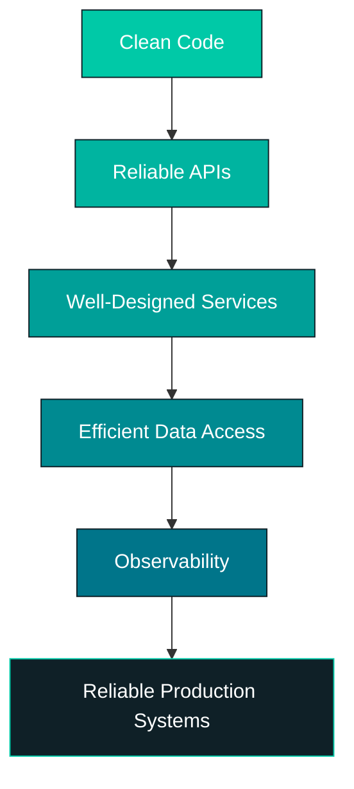

<div align="center">


<br/>


[](https://www.linkedin.com/in/dilip18)
[](https://medium.com/@dilipkumargurijala18)
[](mailto:dilipkumargurijala18@gmail.com)
[](https://gitlab.com/dilipkumargurijala18)

</div>

<br/>

## 🧑‍💻 About Me

```yaml
name: Dilip Kumar Gurijala
role: Senior Java Developer
company: Intellect Informatics Pvt. Ltd.
location: Hyderabad, India
experience: 3+ years in production backend engineering
focus: Spring Boot microservices • REST APIs • AI inference pipelines • Gov-tech platforms
currently_learning: Spring Boot 4 • Spring Framework 7 • Distributed Systems
open_to: Senior Java Developer / Backend Engineer roles • Freelance • Interesting backend problems
```

- 🔭 Currently building **Spring Boot microservices & enterprise backend systems**
- 🤖 Integrating **AI inference services** with **NVIDIA Triton**
- 🌐 Working on government platforms — **AgriStack** & **Bhashini**
- 🐳 Hands-on with **Docker, Apache Tomcat & Linux**
- 📨 Building **event-driven systems with Apache Kafka**
- 🛠️ Automating dev workflows with **Shell scripting**
- ✍️ Writing technical articles on **Java, Spring Boot & Backend Engineering**
- ⚡ Fun fact: I think a backend isn't done until it's *observable*, not just *working*

<br/>

## ⚡ Quick Facts

<div align="center">

| 💼 Experience | 🏢 Current Role | 📍 Location | ☕ Primary Stack |
|:---:|:---:|:---:|:---:|
| **3+ Years** | **Java Developer @ Intellect Informatics** | **Hyderabad, India** | **Java + Spring Boot** |

| 🏗️ Architecture | 🤖 AI Infra | 🏛️ Gov Integrations | 📨 Messaging | 🗄️ Databases |
|:---:|:---:|:---:|:---:|:---:|
| Microservices / REST | NVIDIA Triton + Docker | AgriStack + Bhashini | Apache Kafka | MySQL + MS SQL Server |

</div>

<br/>

## 🛠️ Tech Stack

<div align="center">

### ☕ Backend & Frameworks


### 🏗️ Architecture, APIs & Messaging


### 🗄️ Databases


### 🐳 DevOps, Infra & Tools


### 🤖 AI / ML Infrastructure


### 🧪 Testing


### 🖥️ Frontend


</div>

<br/>

## 💼 Professional Experience

<table>
<tr>
<td width="120" align="center" valign="top">
<br/><br/>
☕
</td>
<td>

### **Java Developer** — Intellect Informatics Pvt. Ltd.
📍 Hyderabad, India &nbsp;|&nbsp; 📅 **August 2023 — Present**

Working on production-grade backend systems using **Java, Spring Boot, microservices and relational databases.**

**What I work on:**

| | | |
|---|---|---|
| 🏗️ Spring Boot microservices | 🔌 RESTful APIs | 🗄️ Hibernate / JPA persistence |
| 🏛️ Government platform integrations | 🤖 AI inference (NVIDIA Triton) | 📨 Event-driven systems (Kafka) |
| 🐳 Containerized deployments | 🚀 WAR deployments on Tomcat | 🐧 Linux administration |
| 🔐 API security & service auth | 📊 Logging & monitoring | 🧪 Unit testing (JUnit/Mockito) |
| 🔍 Code reviews & debugging | 🤝 Agile/Scrum collaboration | ⚙️ Shell scripting automation |

</td>
</tr>
</table>

<br/>

## 🚀 Featured Projects

<table width="100%">
<tr>
<td width="50%" valign="top">

### 🤖 Multilingual Translation Platform
**OneMTBig / Bhashini · NVIDIA Triton · Docker · Spring Boot**

Integrated the OneMTBig multilingual translation model under the Bhashini ecosystem, serving inference through NVIDIA Triton Inference Server, with a Spring Boot backend enabling real-time translation between English and Indian languages.

`#NVIDIA-Triton` `#Docker` `#SpringBoot` `#Multilingual`

**Outcome:** Real-time English ⇄ Indian-language translation.

</td>
<td width="50%" valign="top">

### 🌾 AgriStack Farmer Data Integration
**Spring Boot · REST APIs · Government Platform**

Built backend integrations with the AgriStack ecosystem to securely retrieve and exchange farmer, land, and crop information across internal systems.

`#REST-APIs` `#GovTech` `#DataIntegration` `#Validation`

**Outcome:** Farmer, land & crop data accessible across connected systems.

</td>
</tr>
<tr>
<td width="50%" valign="top">

### 🏦 e-PACS Mobile Application Backend
**Spring Boot · MS SQL Server · REST APIs**

Backend services powering a cooperative banking mobile application — covering API development, database integration, and core business logic.

`#SpringBoot` `#MSSQL` `#Banking` `#MobileBackend`

**Outcome:** Reliable backend & data services for a live banking app.

</td>
<td width="50%" valign="top">

### 🏢 Enterprise ERP Backend
**Spring Boot · MySQL · Microservices**

Contributed to a multi-module ERP platform composed of independently deployable backend services across different business domains.

`#Microservices` `#MySQL` `#Kafka` `#Hibernate`

**Outcome:** Continuous delivery across multiple backend modules.

</td>
</tr>
<tr>
<td width="50%" valign="top">

### ⚙️ CRUD Automation Tool
**Shell Scripting · Spring Boot · Linux**

A Shell-based automation tool that scaffolds the repetitive `Entity → Repository → Service → ServiceImpl → Controller` structure for Spring Boot apps.

`#ShellScripting` `#DevTools` `#Automation`

**Outcome:** Reduced repetitive dev effort, faster feature delivery.

</td>
<td width="50%" valign="top">

### 🔐 Secure API Gateway
**Spring Boot · API Security · Microservices**

A lightweight gateway service providing controlled, authenticated access between internal microservices.

`#APIGateway` `#Security` `#Microservices`

**Focus:** Auth, request validation, centralized access control.

</td>
</tr>
</table>

<br/>

## 🧠 What I Care About

<div align="center">



**A production backend should be:**
`Scalable` · `Maintainable` · `Observable` · `Secure` · `Testable` · `Reliable`

</div>

<br/>

## 📚 Technical Writing

I write about things I learn while working on real backend systems.

<div align="center">

`Java` `Spring Boot` `Design Patterns` `REST APIs` `Apache Kafka` `Linux` `Shell Scripting` `Docker` `Microservices` `Backend Engineering`

[](https://medium.com/@dilipkumargurijala18)

</div>

<br/>

## 📊 GitHub Analytics

<div align="center">


</div>

<br/>

## 🎯 Currently

```text
Building       → Production-grade Java Backend Systems
Learning       → Spring Boot 4 / Spring Framework 7
Exploring      → Distributed Systems & Cloud-Native Architecture
Working With   → Microservices + Kafka + Docker
Interested In  → Backend Architecture & System Design
Writing About  → Java + Spring Boot + Linux
```

<br/>

## 🤝 Let's Connect

I'm currently **open to Senior Java Developer / Backend Engineer opportunities, freelance work, and interesting backend projects.**

If you're working with **Java, Spring Boot, Microservices, APIs, Kafka, AI infrastructure, or backend architecture** — let's talk.

<div align="center">

[](mailto:dilipkumargurijala18@gmail.com)
[](tel:+917569639930)
[]()

</div>

<br/>


<div align="center">

### 💻 Build systems. Solve problems. Keep learning.
**Thanks for visiting my profile! ⭐**

</div>
